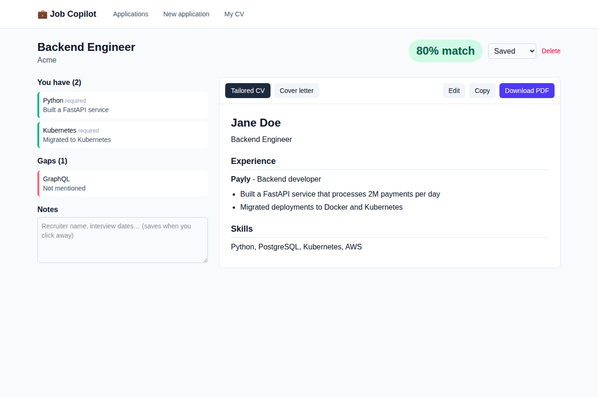
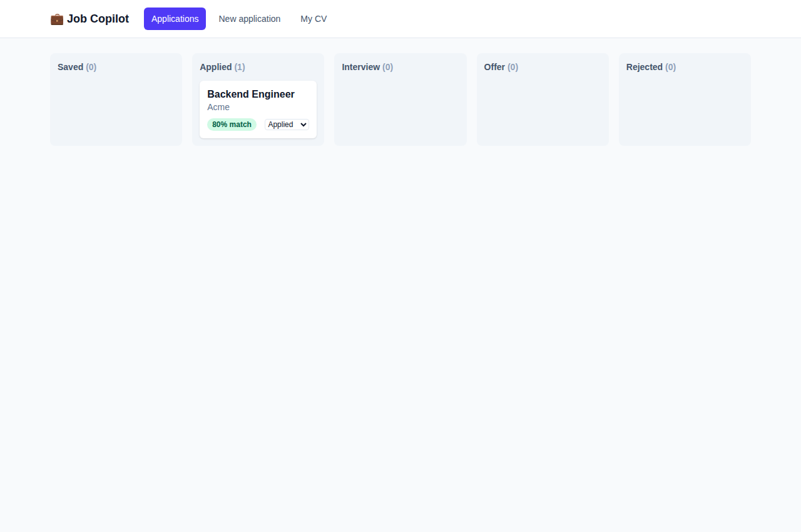

# Job Copilot

An AI assistant for job seekers. Upload your CV once, paste a job posting, and it:

1. Pulls out what the job asks for.
2. Finds where your CV already proves each requirement (and where it doesn't).
3. Writes a CV and cover letter tailored to that job, using only facts from your CV.
4. Tracks every application on a board (Saved, Applied, Interview, Offer, Rejected).

**Stack:** React + Vite + TypeScript + Tailwind (frontend), Python + FastAPI (backend),
LangGraph + Claude API (AI agent), PostgreSQL + pgvector (database), Docker.

New to this stack? Read [LEARNING.md](LEARNING.md). It walks through the project step by step.




## Run it

You need [Docker Desktop](https://www.docker.com/products/docker-desktop/) and an
[Anthropic API key](https://console.anthropic.com).

```powershell
copy .env.example .env      # then open .env and paste your API key
docker compose up --build
```

Open http://localhost:5173. The first CV upload takes a little longer while the embedding
model downloads.

### Run without Docker (for development)

```powershell
docker compose up db -d                 # only the database

cd backend
python -m venv .venv
.venv\Scripts\activate                  # macOS/Linux: source .venv/bin/activate
pip install -r requirements.txt
uvicorn app.main:app --reload           # API on http://localhost:8000/docs

cd ../frontend                          # in a second terminal
npm install
npm run dev                             # app on http://localhost:5173
```

### Tests

```powershell
cd backend
python -m pytest
```
